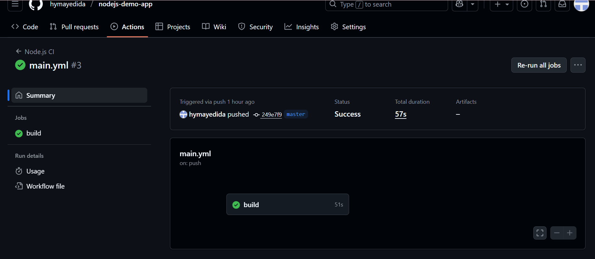
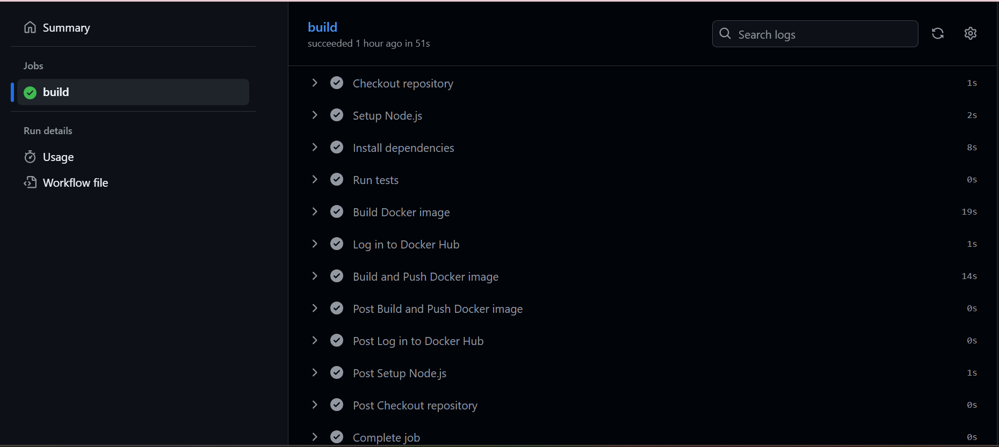
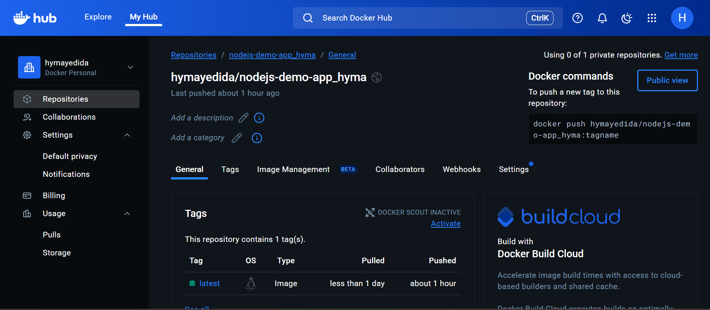

# Automate Code Deployment Using CI/CD Pipeline (GitHub Actions)

## Overview
Goal: Automate Code Deployment Using CI/CD Pipeline

Tools: GitHub, GitHub Actions, Node.js, Docker Hub.

## Prerequisites

1) A GitHub repo .
2) A Docker Hub account.
3) Dockerfile present in repo root .
4) package.json and package-lock.json present 

## Project Overview — Simple Node.js App

Purpose: A simple web application built with Node.js.
Feature: Uses MediaWiki’s Search API to fetch results from Wikipedia based on the user’s search input.

## Add GitHub repository secrets

1) In GitHub → go to  repository → Settings → Secrets and variables → Actions → New repository secret.
2) Add these two secrets:
       DOCKERHUB_USERNAME → Docker Hub username 
       DOCKERHUB_TOKEN → Docker Hub password 
These secrets will be referenced by the workflow to log in to Docker Hub

## Create the workflow file (.github/workflows/main.yml)

Created the file in the repository (via GitHub UI Add file → Create new file or locally and push)

```
name: Node.js CI


on:
  push:
    branches: [ "master", "main" ]
  pull_request:
    branches: [ "master", "main" ]

jobs:
  build:
    runs-on: ubuntu-latest

    steps:
      
      - name: Checkout repository
        uses: actions/checkout@v4

      - name: Setup Node.js
        uses: actions/setup-node@v4
        with:
          node-version: 18

      - name: Install dependencies
        run: npm install


      - name: Run tests
        run: npm test || echo "No tests found"


      - name: Build Docker image
        if: github.event_name == 'push' # optional: only build on push
        run: |
          docker build -t HymaYedida/nodejs-demo-app_hyma:latest .
      - name: Log in to Docker Hub
        uses: docker/login-action@v2
        with:
          username: ${{ secrets.DOCKER_USERNAME }}
          password: ${{ secrets.DOCKER_PASSWORD }}

      - name: Build and Push Docker image
        uses: docker/build-push-action@v5
        with:
          push: true
          tags: HymaYedida/nodejs-demo-app_hyma:latest
```
## Githubactions results

* On every push or pull request to the main branch, the GitHub Actions pipeline triggers automatically, builds the project, and publishes a new Docker image to Docker Hub.
 


## Docker image in Docker Hub

